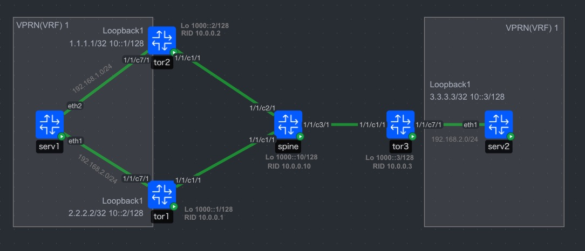

# SRv6 L3VPN (End.DT46) over BGP Unnumbered

This is a verification environment using Nokia SR OS, featuring BGP Unnumbered for the Underlay and SRv6 L3VPN (End.DT46) for the Overlay.

## Overview

This lab validates the operation of **End.DT46** (Dual-Stack Decapsulation), which encapsulates both IPv4 and IPv6 dual-stack traffic into a single SRv6 SID.

* **Underlay**: Equal-Cost Multi-Path (ECMP) configuration via BGP Unnumbered (based on IPv6 RA).
* **Overlay**: VPN-IPv4/IPv6 route exchange via eBGP Multi-hop.
* **Encapsulation**: SRv6 (End.DT46 function).
* **VRF**: Mutual connectivity between Loopback1 interfaces within `vprn 1`.

## Topology



## Configuration Highlights

1. **BGP Unnumbered & Authentication**:
* Underlay adjacency is established automatically using IPv6 Router Advertisement.
* MD5 password authentication is applied to all BGP peering (both Underlay and Overlay).


2. **SRv6 Locator & End.DT46**:
* A unique Locator (`1000:0:0:X::/64`) is defined for each TOR.
* Both IPv4 and IPv6 traffic are mapped to VRF `1` using the `function end-dt46`.


3. **BGP Extended Next-Hop Encoding**:
* `extended-nh-encoding vpn-ipv4 true` is configured to allow IPv6 addresses (System IP) to be used as the next-hop for IPv4 VPN routes.


4. **Policy-Based Routing Advertisement**:
* `policy-options` are used to advertise only the local System IPv6 address and the SRv6 Locator prefix via the Underlay BGP.


---

## Configuration

### tor1

<details>  

```text
/configure { policy-options prefix-list "SRv6-Locator" prefix 1000:0:0:1::/64 type exact }
/configure { policy-options prefix-list "System_Lo_IPv6" prefix 1000::1/128 type exact }
/configure policy-options policy-statement "EXP-EBGP-LOOPBACK" entry 10 from prefix-list ["System_Lo_IPv6"]
/configure policy-options policy-statement "EXP-EBGP-LOOPBACK" entry 10 to protocol name [bgp]
/configure policy-options policy-statement "EXP-EBGP-LOOPBACK" entry 10 action action-type accept
/configure policy-options policy-statement "EXP-EBGP-LOOPBACK" entry 20 from prefix-list ["SRv6-Locator"]
/configure policy-options policy-statement "EXP-EBGP-LOOPBACK" entry 20 to protocol name [bgp]
/configure policy-options policy-statement "EXP-EBGP-LOOPBACK" entry 20 action action-type accept
/configure policy-options policy-statement "VRF10-IMPORT" entry 10 action action-type accept
/configure policy-options policy-statement "VRF10-IMPORT" default-action action-type accept
/configure port 1/1/c1 admin-state enable
/configure port 1/1/c1 connector breakout c1-100g
/configure port 1/1/c1/1 admin-state enable
/configure port 1/1/c1/1 ethernet mode network
/configure port 1/1/c1/1 ethernet lldp dest-mac nearest-bridge receive true
/configure port 1/1/c1/1 ethernet lldp dest-mac nearest-bridge transmit true
/configure port 1/1/c1/1 ethernet lldp dest-mac nearest-bridge tx-tlvs port-desc true
/configure port 1/1/c1/1 ethernet lldp dest-mac nearest-bridge tx-tlvs sys-name true
/configure port 1/1/c1/1 ethernet lldp dest-mac nearest-bridge tx-tlvs sys-desc true
/configure port 1/1/c1/1 ethernet lldp dest-mac nearest-bridge tx-tlvs sys-cap true
/configure port 1/1/c7 admin-state enable
/configure port 1/1/c7 connector breakout c1-25g
/configure port 1/1/c7/1 admin-state enable
/configure port 1/1/c7/1 ethernet mode network
/configure port 1/1/c7/1 ethernet lldp dest-mac nearest-bridge receive true
/configure port 1/1/c7/1 ethernet lldp dest-mac nearest-bridge transmit true
/configure port 1/1/c7/1 ethernet lldp dest-mac nearest-bridge tx-tlvs port-desc true
/configure port 1/1/c7/1 ethernet lldp dest-mac nearest-bridge tx-tlvs sys-name true
/configure port 1/1/c7/1 ethernet lldp dest-mac nearest-bridge tx-tlvs sys-desc true
/configure port 1/1/c7/1 ethernet lldp dest-mac nearest-bridge tx-tlvs sys-cap true
/configure router "Base" autonomous-system 65001
/configure router "Base" router-id 10.0.0.1
/configure router "Base" interface "system" ipv6 address 1000::1 prefix-length 128
/configure router "Base" interface "to-spine" admin-state enable
/configure router "Base" interface "to-spine" port 1/1/c1/1
/configure router "Base" interface "to-spine" ipv4 unnumbered system
/configure { router "Base" interface "to-spine" ipv6 }
/configure router "Base" ipv6 router-advertisement interface "to-spine" admin-state enable
/configure router "Base" ipv6 router-advertisement interface "to-spine" min-advertisement-interval 10
/configure router "Base" mpls-labels reserved-label-block "SRV6-16bits-FL" start-label 200000
/configure router "Base" mpls-labels reserved-label-block "SRV6-16bits-FL" end-label 265534
/configure router "Base" bgp connect-retry 1
/configure router "Base" bgp min-route-advertisement 1
/configure router "Base" bgp initial-send-delay-zero true
/configure router "Base" bgp router-id 10.0.0.1
/configure router "Base" bgp rapid-withdrawal true
/configure router "Base" bgp split-horizon true
/configure router "Base" bgp ebgp-default-reject-policy import false
/configure router "Base" bgp ebgp-default-reject-policy export false
/configure router "Base" bgp best-path-selection always-compare-med med-value on
/configure router "Base" bgp best-path-selection always-compare-med strict-as true
/configure router "Base" bgp rapid-update vpn-ipv4 true
/configure router "Base" bgp rapid-update vpn-ipv6 true
/configure router "Base" bgp group "BGP_Unnumbered" authentication-key "KrbVPnF6Dg13PM/biw6ErLBhicDE hash2"
/configure router "Base" bgp group "BGP_Unnumbered" type internal
/configure router "Base" bgp group "BGP_Unnumbered" family ipv4 false
/configure router "Base" bgp group "BGP_Unnumbered" family ipv6 true
/configure router "Base" bgp group "BGP_Unnumbered" export policy ["EXP-EBGP-LOOPBACK"]
/configure router "Base" bgp group "BGP_Unnumbered" dynamic-neighbor interface "to-spine" allowed-peer-as ["65000" "65010"]
/configure router "Base" bgp group "SRV6-GROUP" admin-state enable
/configure router "Base" bgp group "SRV6-GROUP" multihop 254
/configure router "Base" bgp group "SRV6-GROUP" next-hop-self true
/configure router "Base" bgp group "SRV6-GROUP" peer-ip-tracking true
/configure router "Base" bgp group "SRV6-GROUP" family vpn-ipv4 true
/configure router "Base" bgp group "SRV6-GROUP" family vpn-ipv6 true
/configure router "Base" bgp group "SRV6-GROUP" extended-nh-encoding vpn-ipv4 true
/configure router "Base" bgp group "SRV6-GROUP" advertise-ipv6-next-hops vpn-ipv6 true
/configure router "Base" bgp group "SRV6-GROUP" advertise-ipv6-next-hops vpn-ipv4 true
/configure router "Base" bgp neighbor "1000::2" admin-state enable
/configure router "Base" bgp neighbor "1000::2" group "SRV6-GROUP"
/configure router "Base" bgp neighbor "1000::2" peer-as 65002
/configure router "Base" bgp neighbor "1000::3" admin-state enable
/configure router "Base" bgp neighbor "1000::3" group "SRV6-GROUP"
/configure router "Base" bgp neighbor "1000::3" peer-as 65003
/configure router "Base" bgp segment-routing-v6 family ipv4 ignore-received-srv6-tlvs false
/configure router "Base" bgp segment-routing-v6 family ipv4 add-srv6-tlvs locator-name "tor1-loc"
/configure router "Base" bgp segment-routing-v6 family ipv6 ignore-received-srv6-tlvs true
/configure router "Base" bgp segment-routing-v6 family ipv6 add-srv6-tlvs locator-name "tor1-loc"
/configure router "Base" segment-routing segment-routing-v6 source-address 1000::1
/configure router "Base" segment-routing segment-routing-v6 locator "tor1-loc" admin-state enable
/configure router "Base" segment-routing segment-routing-v6 locator "tor1-loc" block-length 48
/configure router "Base" segment-routing segment-routing-v6 locator "tor1-loc" prefix ip-prefix 1000:0:0:1::/64
/configure router "Base" segment-routing segment-routing-v6 locator "tor1-loc" static-function max-entries 3
/configure router "Base" segment-routing segment-routing-v6 base-routing-instance locator "tor1-loc" function end 1 srh-mode usp
/configure router "Base" segment-routing segment-routing-v6 base-routing-instance locator "tor1-loc" function end-dt46 value 2
/configure service vprn "1" admin-state enable
/configure service vprn "1" customer "1"
/configure { service vprn "1" segment-routing-v6 1 locator "tor1-loc" function end-dt46 }
/configure service vprn "1" bgp-ipvpn segment-routing-v6 1 admin-state enable
/configure service vprn "1" bgp-ipvpn segment-routing-v6 1 route-distinguisher "10.0.0.1:1"
/configure service vprn "1" bgp-ipvpn segment-routing-v6 1 source-address 1000::1
/configure service vprn "1" bgp-ipvpn segment-routing-v6 1 vrf-target import-community "target:1:1"
/configure service vprn "1" bgp-ipvpn segment-routing-v6 1 vrf-target export-community "target:1:1"
/configure service vprn "1" bgp-ipvpn segment-routing-v6 1 srv6 instance 1
/configure service vprn "1" bgp-ipvpn segment-routing-v6 1 srv6 default-locator "tor1-loc"
/configure service vprn "1" interface "Loopback1" admin-state enable
/configure service vprn "1" interface "Loopback1" loopback true
/configure service vprn "1" interface "Loopback1" ipv4 primary address 1.1.1.1
/configure service vprn "1" interface "Loopback1" ipv4 primary prefix-length 32
/configure service vprn "1" interface "Loopback1" ipv6 address 10::1 prefix-length 128
/configure service vprn "1" bgp-vpn-backup ipv4 true
/configure service vprn "1" bgp-vpn-backup ipv6 true
/configure system name "tor1"
/configure system login-control idle-timeout none
/configure system time zone non-standard name "jst"
/configure system time zone non-standard offset "09:00"
/configure system time ntp admin-state enable
/configure { system time ntp server 172.20.20.1 router-instance "management" }

```
</details>  

### tor2

<details>  

```text
/configure { policy-options prefix-list "SRv6-Locator" prefix 1000:0:0:2::/64 type exact }
/configure { policy-options prefix-list "System_Lo_IPv6" prefix 1000::2/128 type exact }
/configure policy-options policy-statement "EXP-EBGP-LOOPBACK" entry 10 from prefix-list ["System_Lo_IPv6"]
/configure policy-options policy-statement "EXP-EBGP-LOOPBACK" entry 10 to protocol name [bgp]
/configure policy-options policy-statement "EXP-EBGP-LOOPBACK" entry 10 action action-type accept
/configure policy-options policy-statement "EXP-EBGP-LOOPBACK" entry 20 from prefix-list ["SRv6-Locator"]
/configure policy-options policy-statement "EXP-EBGP-LOOPBACK" entry 20 to protocol name [bgp]
/configure policy-options policy-statement "EXP-EBGP-LOOPBACK" entry 20 action action-type accept
/configure port 1/1/c1 admin-state enable
/configure port 1/1/c1 connector breakout c1-100g
/configure port 1/1/c1/1 admin-state enable
/configure port 1/1/c1/1 ethernet mode network
/configure port 1/1/c1/1 ethernet lldp dest-mac nearest-bridge receive true
/configure port 1/1/c1/1 ethernet lldp dest-mac nearest-bridge transmit true
/configure port 1/1/c1/1 ethernet lldp dest-mac nearest-bridge tx-tlvs port-desc true
/configure port 1/1/c1/1 ethernet lldp dest-mac nearest-bridge tx-tlvs sys-name true
/configure port 1/1/c1/1 ethernet lldp dest-mac nearest-bridge tx-tlvs sys-desc true
/configure port 1/1/c1/1 ethernet lldp dest-mac nearest-bridge tx-tlvs sys-cap true
/configure port 1/1/c7 admin-state enable
/configure port 1/1/c7 connector breakout c1-25g
/configure port 1/1/c7/1 admin-state enable
/configure port 1/1/c7/1 ethernet mode network
/configure port 1/1/c7/1 ethernet lldp dest-mac nearest-bridge receive true
/configure port 1/1/c7/1 ethernet lldp dest-mac nearest-bridge transmit true
/configure port 1/1/c7/1 ethernet lldp dest-mac nearest-bridge tx-tlvs port-desc true
/configure port 1/1/c7/1 ethernet lldp dest-mac nearest-bridge tx-tlvs sys-name true
/configure port 1/1/c7/1 ethernet lldp dest-mac nearest-bridge tx-tlvs sys-desc true
/configure port 1/1/c7/1 ethernet lldp dest-mac nearest-bridge tx-tlvs sys-cap true
/configure router "Base" autonomous-system 65002
/configure router "Base" router-id 10.0.0.2
/configure router "Base" interface "system" ipv6 address 1000::2 prefix-length 128
/configure router "Base" interface "to-spine" admin-state enable
/configure router "Base" interface "to-spine" port 1/1/c1/1
/configure router "Base" interface "to-spine" ipv4 unnumbered system
/configure { router "Base" interface "to-spine" ipv6 }
/configure router "Base" ipv6 router-advertisement interface "to-spine" admin-state enable
/configure router "Base" ipv6 router-advertisement interface "to-spine" min-advertisement-interval 10
/configure router "Base" mpls-labels reserved-label-block "SRV6-16bits-FL" start-label 200000
/configure router "Base" mpls-labels reserved-label-block "SRV6-16bits-FL" end-label 265534
/configure router "Base" bgp connect-retry 1
/configure router "Base" bgp min-route-advertisement 1
/configure router "Base" bgp initial-send-delay-zero true
/configure router "Base" bgp router-id 10.0.0.2
/configure router "Base" bgp rapid-withdrawal true
/configure router "Base" bgp split-horizon true
/configure router "Base" bgp ebgp-default-reject-policy import false
/configure router "Base" bgp ebgp-default-reject-policy export false
/configure router "Base" bgp best-path-selection always-compare-med med-value on
/configure router "Base" bgp best-path-selection always-compare-med strict-as true
/configure router "Base" bgp rapid-update vpn-ipv4 true
/configure router "Base" bgp rapid-update vpn-ipv6 true
/configure router "Base" bgp group "BGP_Unnumbered" authentication-key "KrbVPnF6Dg13PM/biw6ErLBhicDE hash2"
/configure router "Base" bgp group "BGP_Unnumbered" type internal
/configure router "Base" bgp group "BGP_Unnumbered" family ipv4 false
/configure router "Base" bgp group "BGP_Unnumbered" family ipv6 true
/configure router "Base" bgp group "BGP_Unnumbered" export policy ["EXP-EBGP-LOOPBACK"]
/configure router "Base" bgp group "BGP_Unnumbered" dynamic-neighbor interface "to-spine" allowed-peer-as ["65000" "65010"]
/configure router "Base" bgp group "SRV6-GROUP" admin-state enable
/configure router "Base" bgp group "SRV6-GROUP" multihop 254
/configure router "Base" bgp group "SRV6-GROUP" next-hop-self true
/configure router "Base" bgp group "SRV6-GROUP" peer-ip-tracking true
/configure router "Base" bgp group "SRV6-GROUP" family vpn-ipv4 true
/configure router "Base" bgp group "SRV6-GROUP" family vpn-ipv6 true
/configure router "Base" bgp group "SRV6-GROUP" extended-nh-encoding vpn-ipv4 true
/configure router "Base" bgp group "SRV6-GROUP" advertise-ipv6-next-hops vpn-ipv6 true
/configure router "Base" bgp group "SRV6-GROUP" advertise-ipv6-next-hops vpn-ipv4 true
/configure router "Base" bgp neighbor "1000::1" admin-state enable
/configure router "Base" bgp neighbor "1000::1" group "SRV6-GROUP"
/configure router "Base" bgp neighbor "1000::1" peer-as 65001
/configure router "Base" bgp neighbor "1000::3" admin-state enable
/configure router "Base" bgp neighbor "1000::3" group "SRV6-GROUP"
/configure router "Base" bgp neighbor "1000::3" peer-as 65003
/configure router "Base" bgp segment-routing-v6 family ipv4 ignore-received-srv6-tlvs false
/configure router "Base" bgp segment-routing-v6 family ipv4 add-srv6-tlvs locator-name "tor2-loc"
/configure router "Base" bgp segment-routing-v6 family ipv6 ignore-received-srv6-tlvs true
/configure router "Base" bgp segment-routing-v6 family ipv6 add-srv6-tlvs locator-name "tor2-loc"
/configure router "Base" segment-routing segment-routing-v6 source-address 1000::2
/configure router "Base" segment-routing segment-routing-v6 locator "tor2-loc" admin-state enable
/configure router "Base" segment-routing segment-routing-v6 locator "tor2-loc" block-length 48
/configure router "Base" segment-routing segment-routing-v6 locator "tor2-loc" prefix ip-prefix 1000:0:0:2::/64
/configure router "Base" segment-routing segment-routing-v6 locator "tor2-loc" static-function max-entries 3
/configure router "Base" segment-routing segment-routing-v6 base-routing-instance locator "tor2-loc" function end 1 srh-mode usp
/configure router "Base" segment-routing segment-routing-v6 base-routing-instance locator "tor2-loc" function end-dt46 value 2
/configure service vprn "1" admin-state enable
/configure service vprn "1" customer "1"
/configure { service vprn "1" segment-routing-v6 1 locator "tor2-loc" function end-dt46 }
/configure service vprn "1" bgp-ipvpn segment-routing-v6 1 admin-state enable
/configure service vprn "1" bgp-ipvpn segment-routing-v6 1 route-distinguisher "10.0.0.2:1"
/configure service vprn "1" bgp-ipvpn segment-routing-v6 1 source-address 1000::2
/configure service vprn "1" bgp-ipvpn segment-routing-v6 1 vrf-target import-community "target:1:1"
/configure service vprn "1" bgp-ipvpn segment-routing-v6 1 vrf-target export-community "target:1:1"
/configure service vprn "1" bgp-ipvpn segment-routing-v6 1 srv6 instance 1
/configure service vprn "1" bgp-ipvpn segment-routing-v6 1 srv6 default-locator "tor2-loc"
/configure service vprn "1" interface "Loopback1" loopback true
/configure service vprn "1" interface "Loopback1" ipv4 primary address 2.2.2.2
/configure service vprn "1" interface "Loopback1" ipv4 primary prefix-length 32
/configure service vprn "1" interface "Loopback1" ipv6 address 10::2 prefix-length 128
/configure system name "tor2"
/configure system login-control idle-timeout none
/configure system time zone non-standard name "jst"
/configure system time zone non-standard offset "09:00"
/configure system time ntp admin-state enable
/configure { system time ntp server 172.20.20.1 router-instance "management" }

```

</details>  

### tor3

<details>  

```text
/configure { policy-options prefix-list "SRv6-Locator" prefix 1000:0:0:3::/64 type exact }
/configure { policy-options prefix-list "System_Lo_IPv6" prefix 1000::3/128 type exact }
/configure policy-options policy-statement "EXP-EBGP-LOOPBACK" entry 10 from prefix-list ["System_Lo_IPv6"]
/configure policy-options policy-statement "EXP-EBGP-LOOPBACK" entry 10 to protocol name [bgp]

/configure policy-options policy-statement "EXP-EBGP-LOOPBACK" entry 10 action action-type accept
/configure policy-options policy-statement "EXP-EBGP-LOOPBACK" entry 20 from prefix-list ["SRv6-Locator"]
/configure policy-options policy-statement "EXP-EBGP-LOOPBACK" entry 20 to protocol name [bgp]
/configure policy-options policy-statement "EXP-EBGP-LOOPBACK" entry 20 action action-type accept
/configure port 1/1/c1 admin-state enable
/configure port 1/1/c1 connector breakout c1-100g
/configure port 1/1/c1/1 admin-state enable
/configure port 1/1/c1/1 ethernet mode network
/configure port 1/1/c1/1 ethernet lldp dest-mac nearest-bridge receive true
/configure port 1/1/c1/1 ethernet lldp dest-mac nearest-bridge transmit true
/configure port 1/1/c1/1 ethernet lldp dest-mac nearest-bridge tx-tlvs port-desc true
/configure port 1/1/c1/1 ethernet lldp dest-mac nearest-bridge tx-tlvs sys-name true
/configure port 1/1/c1/1 ethernet lldp dest-mac nearest-bridge tx-tlvs sys-desc true
/configure port 1/1/c1/1 ethernet lldp dest-mac nearest-bridge tx-tlvs sys-cap true
/configure port 1/1/c7 admin-state enable
/configure port 1/1/c7 connector breakout c1-25g
/configure port 1/1/c7/1 admin-state enable
/configure port 1/1/c7/1 ethernet mode network
/configure port 1/1/c7/1 ethernet lldp dest-mac nearest-bridge receive true
/configure port 1/1/c7/1 ethernet lldp dest-mac nearest-bridge transmit true
/configure port 1/1/c7/1 ethernet lldp dest-mac nearest-bridge tx-tlvs port-desc true
/configure port 1/1/c7/1 ethernet lldp dest-mac nearest-bridge tx-tlvs sys-name true
/configure port 1/1/c7/1 ethernet lldp dest-mac nearest-bridge tx-tlvs sys-desc true
/configure port 1/1/c7/1 ethernet lldp dest-mac nearest-bridge tx-tlvs sys-cap true
/configure router "Base" autonomous-system 65003
/configure router "Base" router-id 10.0.0.3
/configure router "Base" interface "system" ipv6 address 1000::3 prefix-length 128
/configure router "Base" interface "to-spine" admin-state enable
/configure router "Base" interface "to-spine" port 1/1/c1/1
/configure router "Base" interface "to-spine" ipv4 unnumbered system
/configure { router "Base" interface "to-spine" ipv6 }
/configure router "Base" ipv6 router-advertisement interface "to-spine" admin-state enable
/configure router "Base" ipv6 router-advertisement interface "to-spine" min-advertisement-interval 10
/configure router "Base" mpls-labels reserved-label-block "SRV6-16bits-FL" start-label 200000
/configure router "Base" mpls-labels reserved-label-block "SRV6-16bits-FL" end-label 265534
/configure router "Base" bgp connect-retry 1
/configure router "Base" bgp min-route-advertisement 1
/configure router "Base" bgp initial-send-delay-zero true
/configure router "Base" bgp router-id 10.0.0.3
/configure router "Base" bgp rapid-withdrawal true
/configure router "Base" bgp split-horizon true
/configure router "Base" bgp ebgp-default-reject-policy import false
/configure router "Base" bgp ebgp-default-reject-policy export false
/configure router "Base" bgp best-path-selection always-compare-med med-value on
/configure router "Base" bgp best-path-selection always-compare-med strict-as true
/configure router "Base" bgp rapid-update vpn-ipv4 true
/configure router "Base" bgp rapid-update vpn-ipv6 true
/configure router "Base" bgp group "BGP_Unnumbered" authentication-key "KrbVPnF6Dg13PM/biw6ErLBhicDE hash2"
/configure router "Base" bgp group "BGP_Unnumbered" type internal
/configure router "Base" bgp group "BGP_Unnumbered" family ipv4 false
/configure router "Base" bgp group "BGP_Unnumbered" family ipv6 true
/configure router "Base" bgp group "BGP_Unnumbered" export policy ["EXP-EBGP-LOOPBACK"]
/configure router "Base" bgp group "BGP_Unnumbered" dynamic-neighbor interface "to-spine" allowed-peer-as ["65000" "65010"]
/configure router "Base" bgp group "SRV6-GROUP" admin-state enable
/configure router "Base" bgp group "SRV6-GROUP" multihop 254
/configure router "Base" bgp group "SRV6-GROUP" next-hop-self true
/configure router "Base" bgp group "SRV6-GROUP" peer-ip-tracking true
/configure router "Base" bgp group "SRV6-GROUP" family vpn-ipv4 true
/configure router "Base" bgp group "SRV6-GROUP" family vpn-ipv6 true
/configure router "Base" bgp group "SRV6-GROUP" extended-nh-encoding vpn-ipv4 true
/configure router "Base" bgp group "SRV6-GROUP" advertise-ipv6-next-hops vpn-ipv6 true
/configure router "Base" bgp group "SRV6-GROUP" advertise-ipv6-next-hops vpn-ipv4 true
/configure router "Base" bgp neighbor "1000::1" admin-state enable
/configure router "Base" bgp neighbor "1000::1" group "SRV6-GROUP"
/configure router "Base" bgp neighbor "1000::1" peer-as 65001
/configure router "Base" bgp neighbor "1000::2" admin-state enable
/configure router "Base" bgp neighbor "1000::2" group "SRV6-GROUP"
/configure router "Base" bgp neighbor "1000::2" peer-as 65002
/configure router "Base" bgp segment-routing-v6 family ipv4 ignore-received-srv6-tlvs false
/configure router "Base" bgp segment-routing-v6 family ipv4 add-srv6-tlvs locator-name "tor3-loc"
/configure router "Base" bgp segment-routing-v6 family ipv6 ignore-received-srv6-tlvs true
/configure router "Base" bgp segment-routing-v6 family ipv6 add-srv6-tlvs locator-name "tor3-loc"
/configure router "Base" segment-routing segment-routing-v6 source-address 1000::3
/configure router "Base" segment-routing segment-routing-v6 locator "tor3-loc" admin-state enable
/configure router "Base" segment-routing segment-routing-v6 locator "tor3-loc" block-length 48
/configure router "Base" segment-routing segment-routing-v6 locator "tor3-loc" prefix ip-prefix 1000:0:0:3::/64
/configure router "Base" segment-routing segment-routing-v6 locator "tor3-loc" static-function max-entries 3
/configure router "Base" segment-routing segment-routing-v6 base-routing-instance locator "tor3-loc" function end 1 srh-mode usp
/configure router "Base" segment-routing segment-routing-v6 base-routing-instance locator "tor3-loc" function end-dt46 value 2
/configure service vprn "1" admin-state enable
/configure service vprn "1" customer "1"
/configure { service vprn "1" segment-routing-v6 1 locator "tor3-loc" function end-dt46 }
/configure service vprn "1" bgp-ipvpn segment-routing-v6 1 admin-state enable
/configure service vprn "1" bgp-ipvpn segment-routing-v6 1 route-distinguisher "10.0.0.3:1"
/configure service vprn "1" bgp-ipvpn segment-routing-v6 1 source-address 1000::3
/configure service vprn "1" bgp-ipvpn segment-routing-v6 1 vrf-target import-community "target:1:1"
/configure service vprn "1" bgp-ipvpn segment-routing-v6 1 vrf-target export-community "target:1:1"
/configure service vprn "1" bgp-ipvpn segment-routing-v6 1 srv6 instance 1
/configure service vprn "1" bgp-ipvpn segment-routing-v6 1 srv6 default-locator "tor3-loc"
/configure service vprn "1" interface "Loopback1" loopback true
/configure service vprn "1" interface "Loopback1" ipv4 primary address 3.3.3.3
/configure service vprn "1" interface "Loopback1" ipv4 primary prefix-length 32
/configure service vprn "1" interface "Loopback1" ipv6 address 10::3 prefix-length 128
/configure system name "tor3"
/configure system login-control idle-timeout none
/configure system time zone non-standard name "jst"
/configure system time zone non-standard offset "09:00"
/configure system time ntp admin-state enable
/configure { system time ntp server 172.20.20.1 router-instance "management" }

```

</details>  

### spine

<details>  

```text
/configure policy-options policy-statement "EXP-EBGP-LOOPBACK" entry 10 from protocol name [direct direct-interface]
/configure policy-options policy-statement "EXP-EBGP-LOOPBACK" entry 10 to protocol name [bgp]
/configure policy-options policy-statement "EXP-EBGP-LOOPBACK" entry 10 action action-type accept
/configure port 1/1/c1 admin-state enable
/configure port 1/1/c1 connector breakout c1-100g
/configure port 1/1/c1/1 admin-state enable
/configure port 1/1/c1/1 ethernet mode network
/configure port 1/1/c1/1 ethernet lldp dest-mac nearest-bridge receive true
/configure port 1/1/c1/1 ethernet lldp dest-mac nearest-bridge transmit true
/configure port 1/1/c1/1 ethernet lldp dest-mac nearest-bridge tx-tlvs port-desc true
/configure port 1/1/c1/1 ethernet lldp dest-mac nearest-bridge tx-tlvs sys-name true
/configure port 1/1/c1/1 ethernet lldp dest-mac nearest-bridge tx-tlvs sys-desc true
/configure port 1/1/c1/1 ethernet lldp dest-mac nearest-bridge tx-tlvs sys-cap true
/configure port 1/1/c2 admin-state enable
/configure port 1/1/c2 connector breakout c1-100g
/configure port 1/1/c2/1 admin-state enable
/configure port 1/1/c2/1 ethernet mode network
/configure port 1/1/c2/1 ethernet lldp dest-mac nearest-bridge receive true
/configure port 1/1/c2/1 ethernet lldp dest-mac nearest-bridge transmit true
/configure port 1/1/c2/1 ethernet lldp dest-mac nearest-bridge tx-tlvs port-desc true
/configure port 1/1/c2/1 ethernet lldp dest-mac nearest-bridge tx-tlvs sys-name true
/configure port 1/1/c2/1 ethernet lldp dest-mac nearest-bridge tx-tlvs sys-desc true
/configure port 1/1/c2/1 ethernet lldp dest-mac nearest-bridge tx-tlvs sys-cap true
/configure port 1/1/c3 admin-state enable
/configure port 1/1/c3 connector breakout c1-100g
/configure port 1/1/c3/1 admin-state enable
/configure port 1/1/c3/1 ethernet mode network
/configure port 1/1/c3/1 ethernet lldp dest-mac nearest-bridge receive true
/configure port 1/1/c3/1 ethernet lldp dest-mac nearest-bridge transmit true
/configure port 1/1/c3/1 ethernet lldp dest-mac nearest-bridge tx-tlvs port-desc true
/configure port 1/1/c3/1 ethernet lldp dest-mac nearest-bridge tx-tlvs sys-name true
/configure port 1/1/c3/1 ethernet lldp dest-mac nearest-bridge tx-tlvs sys-desc true
/configure port 1/1/c3/1 ethernet lldp dest-mac nearest-bridge tx-tlvs sys-cap true
/configure router "Base" autonomous-system 65010
/configure router "Base" router-id 10.0.0.10
/configure router "Base" interface "system" ipv6 address 1000::10 prefix-length 128
/configure router "Base" interface "to-tor1" admin-state enable
/configure router "Base" interface "to-tor1" port 1/1/c1/1
/configure router "Base" interface "to-tor1" ipv4 unnumbered system
/configure { router "Base" interface "to-tor1" ipv6 }
/configure router "Base" interface "to-tor2" admin-state enable
/configure router "Base" interface "to-tor2" port 1/1/c2/1
/configure router "Base" interface "to-tor2" ipv4 unnumbered system
/configure { router "Base" interface "to-tor2" ipv6 }
/configure router "Base" interface "to-tor3" admin-state enable
/configure router "Base" interface "to-tor3" port 1/1/c3/1
/configure router "Base" interface "to-tor3" ipv4 unnumbered system
/configure { router "Base" interface "to-tor3" ipv6 }
/configure router "Base" ipv6 router-advertisement interface "to-tor1" admin-state enable
/configure router "Base" ipv6 router-advertisement interface "to-tor1" min-advertisement-interval 10
/configure router "Base" ipv6 router-advertisement interface "to-tor2" admin-state enable
/configure router "Base" ipv6 router-advertisement interface "to-tor2" min-advertisement-interval 10
/configure router "Base" ipv6 router-advertisement interface "to-tor3" admin-state enable
/configure router "Base" ipv6 router-advertisement interface "to-tor3" min-advertisement-interval 10
/configure router "Base" mpls-labels reserved-label-block "SRV6-16bits-FL" start-label 200000
/configure router "Base" mpls-labels reserved-label-block "SRV6-16bits-FL" end-label 265534
/configure router "Base" bgp connect-retry 1
/configure router "Base" bgp min-route-advertisement 1
/configure router "Base" bgp initial-send-delay-zero true
/configure router "Base" bgp router-id 10.0.0.10
/configure router "Base" bgp rapid-withdrawal true
/configure router "Base" bgp split-horizon true
/configure router "Base" bgp ebgp-default-reject-policy import false
/configure router "Base" bgp ebgp-default-reject-policy export false
/configure router "Base" bgp best-path-selection always-compare-med med-value on
/configure router "Base" bgp best-path-selection always-compare-med strict-as true
/configure router "Base" bgp rapid-update vpn-ipv4 true
/configure router "Base" bgp rapid-update vpn-ipv6 true
/configure router "Base" bgp group "BGP_Unnumbered" authentication-key "KrbVPnF6Dg13PM/biw6ErLBhicDE hash2"
/configure router "Base" bgp group "BGP_Unnumbered" type internal
/configure router "Base" bgp group "BGP_Unnumbered" family ipv4 false
/configure router "Base" bgp group "BGP_Unnumbered" family ipv6 true
/configure router "Base" bgp group "BGP_Unnumbered" export policy ["EXP-EBGP-LOOPBACK"]
/configure router "Base" bgp group "BGP_Unnumbered" dynamic-neighbor interface "to-tor1" allowed-peer-as ["65001"]
/configure router "Base" bgp group "BGP_Unnumbered" dynamic-neighbor interface "to-tor2" allowed-peer-as ["65002"]
/configure router "Base" bgp group "BGP_Unnumbered" dynamic-neighbor interface "to-tor3" allowed-peer-as ["65003"]
/configure system name "spine"
/configure system time zone non-standard name "jst"
/configure system time zone non-standard offset "09:00"
/configure system time ntp admin-state enable
/configure { system time ntp server 172.20.20.1 router-instance "management" }

```

</details>  


---
